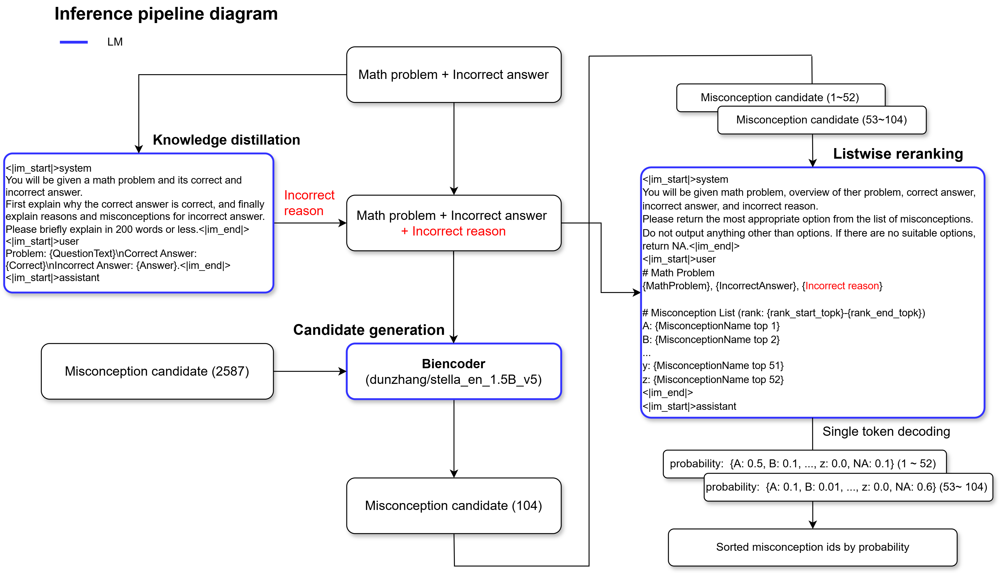

# Eedi 5th solution
This repository contains the training code for the 5th place solution in the kaggle Eedi competition. [Solution page](https://www.kaggle.com/competitions/eedi-mining-misconceptions-in-mathematics/discussion/551391)



## Setup
### Download competition data
```
$ kaggle competitions download -c eedi-mining-misconceptions-in-mathematics
$ unzip eedi-mining-misconceptions-in-mathematics.zip -d input
```
### Build python environment
* Install uv → https://docs.astral.sh/uv/#getting-started
* Install and activate environment
	```
	$ uv sync
	$ . .venv/bin/activate
	```
###	Set OpenRouter API key (this is only required for generation of additional data)
* set your openrouter api key in .env
	```
	$ cp .env_sample .env
	```
### login wandb
```
$ wandb login
```

## Run
* Run all pipeline  
With default parameters(This is almost identical to what we used in our best sub), biencoder training can be done on a 1x4090 GPU. Training the listwise reranker requires an 1xA100 (VRAM: 80GB)
	```
	$ bash run_all.sh
	```
* You can also execute each step by downloading [files](https://drive.google.com/file/d/1Et0YKkpF1lmhD62-rZo6MDiYXJM96gtZ/view?usp=sharing) that contain the intermediate progress saved for each step.


PS: We don't intend to maintain this repository. 

